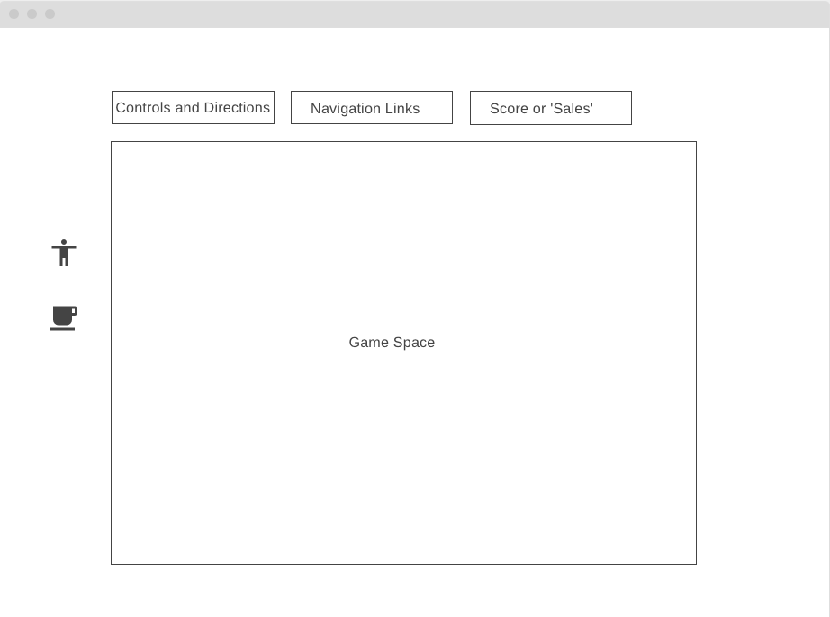

# Welcome to Coffee-Up! 

# Background

***Coffee-Up*** is a game that emulates the start of a coffee business from its grand opening to its normal days! Customers come in and order drinks consisting of a list of ingredients. Your responsibility is to assemble the drink together as more customers come in to the shop. This game is ```phase``` and ```level-based``` in that every week consists of ``7 levels``, representing every day of the week. For example,  ```Phase 1``` is the grand opening week and every level represents level each day of the week. e.g (```Monday``` - ```Sunday```). So, the goal is to:

1) Prevent as many customers from waiting as possible by making their drinks fast;

2) Maximize ```sales```(points)

3) The business will close if your ```sales``` reaches below ```0```


# Functionality & MVPs

In ***Coffee-Up***, users will be able to```:

1) Pause and unpause a game.

2) Fill a randomly generated coffee order by pressing a combination of two buttons corresponding to the drink category and drink ingredient. 

3) Click on an instructions buttons

4) See the score, represented by ```sales```, which would decrease everytime the player fails create a drink in time. 

Users must:

1) Fill the order in time without fail. Failure to press the right key combinations will result in restarting the order. 

Customers will:

1) Come in increasing numbers based on the day of the week

2) Walk out if the time spent waiting for the order is too long.

Game Difficulty is comprised of:

1) Phases and Days of the week

    -  For example, ```Phase 1``` represents the "grand opening" week, consisting of levels of ```1-7```
    -  As level passes, more customers come in
    -  As each phase passes, more drink combinations are created as your business "grows"


Game Score is determined by:

1) Initial start up amount

2) Accumulated points

3) Multiplier (increases based on how many subsequent customers leave)


In addition,  ***Coffee-Up*** will include:

1) A README file

2) Instructions


# Wireframes




# Controls

1) Drink assembly is done by by pressing a ```Category Key``` (which corresponds to the ingredient category) ***in combination*** with a ```Ingredient Key``` (which corresponds to an ingredient/component of the coffee drink).

    * ## The Direction Keys are 
        1. The ```Left``` button = ```Drink Size```
        2. The ```Right``` button = ```Coffee-Type```
        3. The ```Up``` button = ```Toppings```
        4. The ```Down``` button = ```Temperature```
    
    * ## The Ingredients Keys are 
        1. The ```Drink Size``` keys
            * ```Q``` = Small
            * ```W``` = Medium
            * ```E``` = Large
        2. The ```Coffee-Type``` keys
            * ```A``` = Regular Coffee
            * ```S``` = Cold Brew
            * ```D``` = Latte
            * ```F``` = Cappucino
        3. The ```Toppings``` keys
            * ```Z``` = Tapioca
            * ```X``` = Sugar
            * ```C``` = Milk

# Technologies, Libraries, APIs

This project will be implemented with the following technologies:

1) ```Canvas API``` to render the board
2) ```Webpack``` to bundle and transpile the source JavaScript code
3) ```npm``` to manage project dependencies
4) ```HTML``` and ```CSS``` to provide a structure and styling
5) ```JavaScript``` to provide behavior to the code

# Inplementation Timeline
1) ```Thursday```: Project Setup
    -  Being more comfortable with webpack, Canvas API, and looking through javascript event handling material.
    -  Watch a few tutorial videos and look through App Academy Open content
    -  Decide what technologies to use
    -  Decide which canvas background and sprites to use
2) ```Friday & Weekend```: 
    -  ```Friday```

        1) The majority of Friday will be spent watching tutorials on respective technologies and reading documentation in preparation to implement the logic of the game.

        2) Being more comfortable with the environment

        3) Revisiting and solidifying the concept of JavaScript Object-Oriented Programming   

    - ```Saturday & Sunday```

        1) Start the creation of all the classes and determine what methods and instance variables they would have

        2) Begin the blueprint to game logic and have all script files sorted.

        3) If time permits, keep searching for more pixelarts, tutorials, and an audio API implementation.

3) ```Monday```: 
    - Implement all the underlying logic of the game. 
    - Make sure everything renders correctly appropriately. 
4) ```Tuesday```: 
    - Finish making sure everything is rendered appropriatly in the 
canvas. 
    - Create the instruction modal as a hover.  
    - After that, focus on user controls: start, stop, reset.

5) ```Wednesday```: 
    - Finish implementing user control. 
    - Implement the styling portion if time permits. 
    - Add person nav links.

6) ```Thursday Morning```: Deploy to Github pages
         
# Bonus Implementation

if time permits:

- There will be an audio API implementation, allowing a user to lower music, stop music and play music.

- The cashier should be able to move around the counter, appearing as though he is making drinks.


